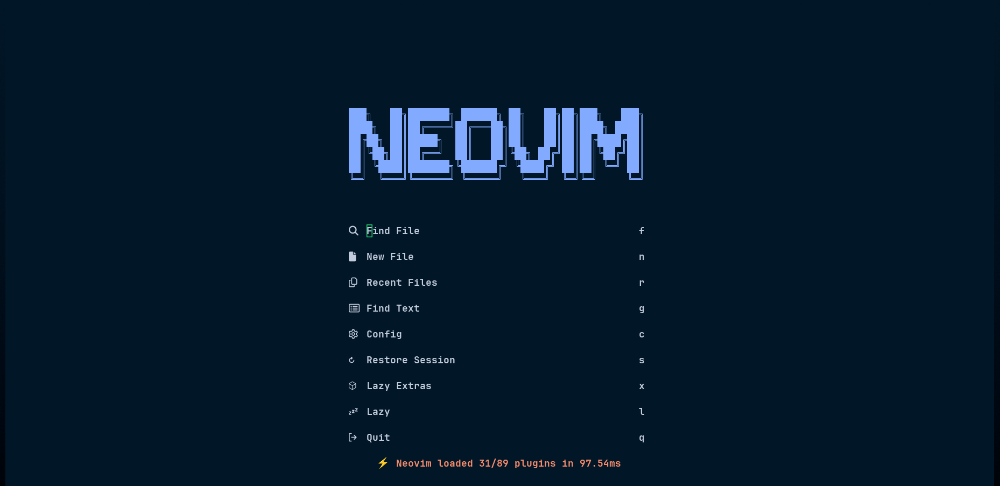

# My Neovim Config


This is my awesome 🔥 Neovim setup powered by [💤 lazy.nvim](https://github.com/folke/lazy.nvim), feel free to take inspiration or use it.

I used for JavaScript/Typescript, Ruby, Go and Flutter development.

## ✨ Features

- 🔥 Transform your Neovim into a full-fledged IDE
- 💤 Easily customize and extend your config with [lazy.nvim](https://github.com/folke/lazy.nvim)
- 🚀 Blazingly fast
- 🧹 Clean settings for options, autocmds, and key maps
- 📦 Comes with a wealth of plugins pre-configured and ready to use
- 🎨 Night Owl as theme

## ⚡️ Requirements

- Neovim >= **0.9.0** (needs to be built with **LuaJIT**)
- Git >= **2.19.0** (for partial clones support)
- a [Nerd Font](https://www.nerdfonts.com/) I use Hack Nerd Font.
- a **C** compiler for `nvim-treesitter`. See [here](https://github.com/nvim-treesitter/nvim-treesitter#requirements)
- A [Codeium Account](https://codeium.com/) (optional), I use it as autocompletion support.
- [Nodejs(LTS)](https://nodejs.org/en) for JavaScript/Typescript development.
- [Flutter Tools](https://docs.flutter.dev/get-started/install) for Mobile development.

- [Go](https://go.dev/),[Ruby](https://www.ruby-lang.org/es/).

### Telescope

- [chafa](https://hpjansson.org/chafa/) (required for image support)
- [ImageMagick](https://imagemagick.org/index.php) (optional, for svg previews)
- [Ripgrep](https://github.com/BurntSushi/ripgrep) for telescope.

## 🚀 Getting Started

- Make a backup of your current Neovim files:

  ```sh
  mv ~/.config/nvim ~/.config/nvim.bak
  mv ~/.local/share/nvim ~/.local/share/nvim.bak
  ```

- Clone this repository

  ```sh
  git clone https://github.com/BrauCamaH/nvim-lazy.git ~/.config/nvim
  ```

- Start Neovim!

  ```sh
  nvim
  ```
